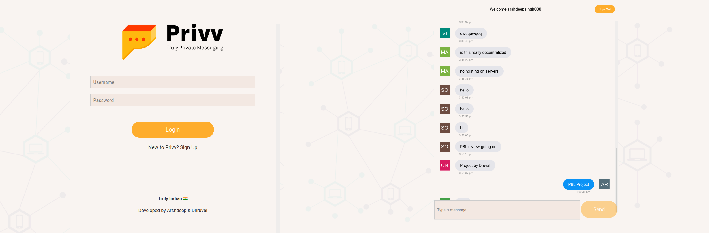

# Privv - Truly Private Messaging



## A decentralized chat app built with [GUN] (https://gun.eco/). 

### Gun.js → Fully Decentralized Graph Database (similar to Firebase for centralized apps) that uses Web3.0 data protocol.
### Svelte → Modern Front-end Javascript Compiler for developing highly optimized UI
### Next.js → Server-side rendering (built on top of Node.js) for generating dynamic web applications
### Vercel → Next.js App Hosting

```
git clone <this-repo>
npm install
npm run dev
```
